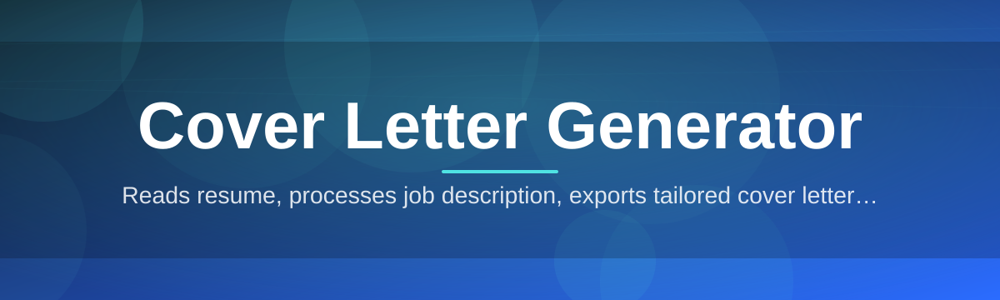
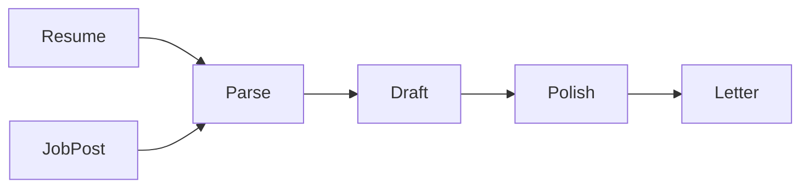

# cover-letter-assistant ✍️🦉

  

*Turn a blank page into a job-winning cover letter in the time it takes to brew coffee.*

  

---

## 🦉 Overview

**TL;DR:** cover-letter-assistant is a standalone Windows app that turns your resume and a job post into a tailored, ready-to-send cover letter — no account, no cloud upload, no drama.

This project started the way most useful tools do — out of frustration. The team behind OwlRevolution was deep in a job-hunting season, staring down a stack of applications, and realized the cover letter was always the last thing anyone wanted to write. Resumes get updated once and reused forever, but a good cover letter has to shift for every role, every company, every tone. That repetitive, high-stakes writing task felt like the perfect thing to automate thoughtfully — not by spitting out generic filler, but by building something that actually reads the job description and writes with intent.

Today, cover-letter-assistant is built for job seekers, career switchers, students entering the workforce, freelancers pitching clients, and recruiters who ghostwrite on behalf of candidates. Whether you're applying to one dream role or fifty applications in a week, the tool adapts. It's a **cover letter generator** in the truest sense — not a template filler, but a writing partner that understands structure, tone, and relevance.

> [!NOTE]
> cover-letter-assistant runs entirely on your machine. Your resume text and job descriptions never leave your device unless you explicitly choose to export or share them.

---

---

## 🔥 What It Actually Does

**TL;DR:** eight core capabilities, each solving a specific pain point in cover letter writing — from blank-page paralysis to last-minute tone mismatches.

- **Smart Job Parsing** — Paste in a job listing and the assistant extracts the role, key responsibilities, and required skills automatically, so your letter speaks the employer's language back to them.

- **Resume-Aware Drafting** — Import your resume once, and every generated letter pulls real accomplishments and skills from it instead of inventing generic filler phrases.

- **Tone Dial** — Slide between Formal, Conversational, Confident, and Warm registers depending on whether you're applying to a law firm or a design studio.

- **Multi-Draft Comparison** — Generate up to three variations side by side and pick the opening line that actually sounds like you.

- **Editable Templates** — Twelve built-in letter structures (classic, narrative, achievement-first, cover-note-style) that you can tweak and save as your own defaults.

- **Keyword Alignment Meter** — A visual bar shows how well your draft echoes the language of the job posting, helping you pass keyword-scanning software with confidence.

- **Export Anywhere** — One click sends your finished letter to PDF, DOCX, or plain text, formatted and ready to attach.

- **Local History Vault** — Every letter you've ever generated is stored locally and searchable, so reapplying to a similar role later takes seconds, not hours.

> [!TIP]
> Use the Keyword Alignment Meter before your final export — a score above 70% tends to correlate with noticeably better response rates from applicant tracking systems.

---

## 🚀 Getting Started

**TL;DR:** visit the landing page, download, unzip, run — you'll have a draft letter in under five minutes.

1. **Visit the landing page** using the download button above.

2. **Download the latest build** — it arrives as a single portable package, no installer wizard required.

3. **Run the executable** — Windows may show a SmartScreen prompt for new apps; click "More info" then "Run anyway."

4. **Paste your resume and the job description** into the two input panes, choose a tone, and hit Generate.

> [!IMPORTANT]
> cover-letter-assistant is unsigned in this release cycle. That's normal for community-maintained tools and doesn't affect functionality — it just means Windows hasn't seen the binary before.

---

## 🖥️ System Requirements

**TL;DR:** any modern Windows machine works — this thing is lightweight by design.

| Requirement | Details |
|---|---|
| **OS** | Windows 10 (64-bit) or Windows 11 |
| **RAM** | 4 GB minimum, 8 GB recommended |
| **Disk Space** | Under 200 MB, standalone executable |
| **Dependencies** | None — no runtime, no framework install needed |
| **Internet** | Not required after download |

  

---

## ⚙️ How It Works

**TL;DR:** your inputs move through four stages — parse, match, draft, polish — before landing in your export folder.

The engine behind cover-letter-assistant isn't magic, it's method. Here's the flow, step by step:

1. **Input Capture** — your resume text and the target job description are read into two separate contexts.

2. **Parsing & Matching** — the app identifies role keywords, required skills, and tone cues from the job post, then cross-references them against your resume's actual content.

3. **Draft Assembly** — using the selected template and tone, the assistant builds a structured letter: opening hook, body paragraphs tied to real experience, and a closing call to action.

4. **Polish Pass** — grammar, sentence flow, and length are checked so the letter reads naturally rather than like a mail-merge.

5. **Export** — you review, tweak if needed, and export to your format of choice.

---

## 🧩 Troubleshooting

**TL;DR:** most issues are quick fixes — here are the ones people actually run into.

<strong>The app won't launch after download.</strong>

Make sure you extracted the full package before running the executable — running it directly from inside a zipped folder can cause missing-file errors.

<strong>My generated letter feels too generic.</strong>

Double-check that your resume text was fully pasted in, including specific numbers and project names. The more concrete detail you give it, the more specific the output becomes.

<strong>The Keyword Alignment Meter stays low no matter what I do.</strong>

This usually means the job description you pasted is too short or vague. Try including the full "Responsibilities" and "Qualifications" sections from the original posting.

<strong>Can I use this for non-English cover letters?</strong>

The current build is optimized for English output only. Multi-language drafting is on the community roadmap.

<strong>Windows SmartScreen is blocking the app.</strong>

This is expected for new, unsigned builds. Click "More info" then "Run anyway" to proceed — the binary is safe, just not yet code-signed.

<strong>My exported PDF has odd spacing.</strong>

Try switching templates — some narrative-style layouts handle longer paragraphs differently than the achievement-first format. Re-export after switching.

> [!WARNING]
> Always proofread your final letter before sending. No generator, however good, replaces a human final check for names, dates, and company-specific details.

---

## 🎨 UI & UX Details

**TL;DR:** dark and light themes, full keyboard control, and a settings panel that remembers your preferences.

**Themes** — toggle between Light, Dark, and an eye-friendly Sepia mode from the settings gear icon.

**Keyboard Shortcuts:**

| Action | Shortcut |
|---|---|
| Generate Draft | `Ctrl + G` |
| Save Letter | `Ctrl + S` |
| New Blank Draft | `Ctrl + N` |
| Switch Tone | `Ctrl + T` |
| Open History Vault | `Ctrl + H` |
| Export | `Ctrl + E` |

**Settings that persist** — default tone, preferred template, and export format are all remembered between sessions so you're not reconfiguring every time.

> [!TIP]
> Pin your most-used template as the default from the Templates tab — it saves a click on every single letter you generate afterward.

---

## 🤝 Contributing & Community

**TL;DR:** issues, ideas, and pull requests are genuinely welcome — this project grows because people use it and speak up.

Found a bug? Open an issue with steps to reproduce it. Have an idea for a new template style or tone option? Start a discussion thread — many of the current features began as community suggestions.

- **Bug reports** — include your Windows version and a description of what you expected vs. what happened.

- **Feature requests** — tell us the job-hunting scenario you're solving for, not just the feature itself.

- **Template contributions** — if you've written a letter structure that works well, consider submitting it for the shared template library.

> [!NOTE]
> This is a community-maintained project. Response times vary, but every issue gets read.

---

## 📜 License

**TL;DR:** MIT, 2026 — use it, fork it, build on it.

This project is released under the [MIT License](LICENSE). Do what you want with it, just keep the license notice intact.

---

## ⚠️ Disclaimer

**TL;DR:** this tool assists your writing — it doesn't guarantee interviews or job offers.

cover-letter-assistant is a writing aid designed to speed up and improve your cover letter drafting process. It does not guarantee employment outcomes, interview callbacks, or applicant tracking system approval. Always review generated content for accuracy before submitting it to an employer. The maintainers are not responsible for outcomes related to job applications submitted using this tool.

---

